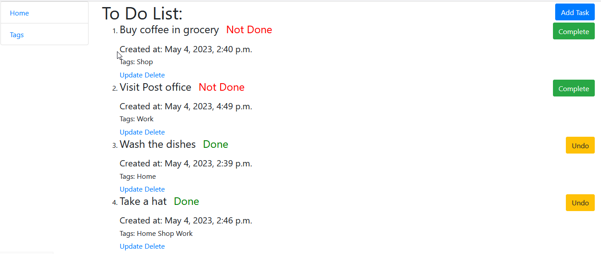

# To-Do List Project 

Django project for managing tasks, 
also you can add tags for your tasks.

## Try it!

Link:

## Installation

Python 3 should be installed

    git clone https://github.com/rakamakaphone/todo-list
    cd friends-imdb
    python -m venv venv
    source venv\Scripts\activate
    pip install -r requirements.txt
    python manage.py migrate
    python manage.py runserver

This project uses environment variables to store sensitive information.
Create a `.env` file in the root directory of your project and add your environment variables to it. This file should not be committed to the repository.
You can see the example in `.env.sample` file

Use the following command to load prepared data from fixture to test and debug your code:

    python manage.py loaddata fixture_data.json

## Features

1. Task managing.
2. Tags managing.

## Demo

